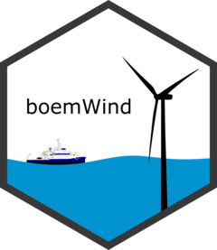

# boemWind <a href=https://jmhatch-noaa.github.io/boemWind/></a>

[](https://github.com/jmhatch-NOAA/boemWind/actions/workflows/secretScan.yml) [](https://github.com/jmhatch-NOAA/boemWind/actions/workflows/update-pkg.yml)

A repository of BOEM Wind Energy Areas (WEAs) in simple features [`sf`](https://r-spatial.github.io/sf/) format stored in an *.rda file for use with [`R`](https://www.r-project.org/). Also includes locations of offshore wind turbines from the [USGS U.S. Wind Turbine Database](https://eerscmap.usgs.gov/uswtdb/).

### Installation

```r
devtools::install_github('jmhatch-NOAA/boemWind')
```

### Legal disclaimer

This repository is a scientific product and is not official communication of the National Oceanic and Atmospheric Administration, or the United States Department of Commerce. All NOAA GitHub project code is provided on an ‘as is’ basis and the user assumes responsibility for its use. Any claims against the Department of Commerce or Department of Commerce bureaus stemming from the use of this GitHub project will be governed by all applicable Federal law. Any reference to specific commercial products, processes, or services by service mark, trademark, manufacturer, or otherwise, does not constitute or imply their endorsement, recommendation or favoring by the Department of Commerce. The Department of Commerce seal and logo, or the seal and logo of a DOC bureau, shall not be used in any manner to imply endorsement of any commercial product or activity by DOC or the United States Government.

---


[U.S. Department of Commerce](https://www.commerce.gov/) | [National Oceanographic and Atmospheric Administration](https://www.noaa.gov) | [NOAA Fisheries](https://www.fisheries.noaa.gov/) | [NEFSC](https://www.fisheries.noaa.gov/about/northeast-fisheries-science-center)
